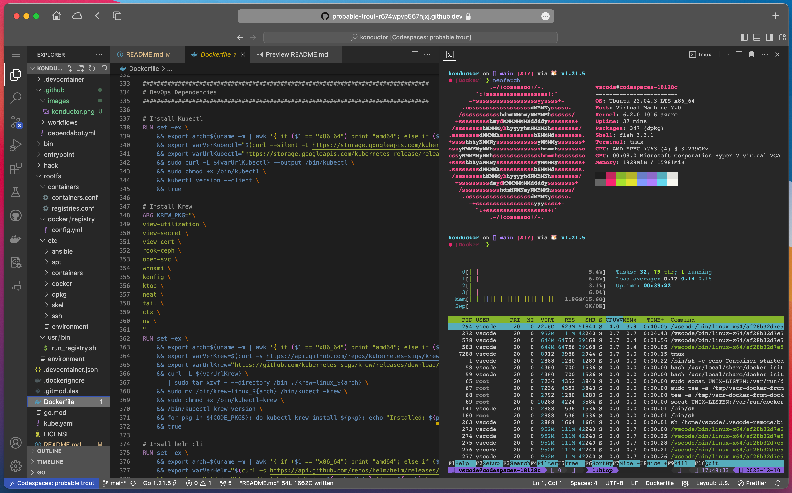

# Pulumi Dev Container

[]() [](https://www.pulumi.com/docs/get-started/install/) [](https://kubernetes.io/docs/tasks/tools/install-kubectl/) [](https://docs.docker.com/get-docker/) [](https://kind.sigs.k8s.io/docs/user/quick-start/) [](https://helm.sh/docs/intro/install/)

[](https://github.com/pulumi/devcontainer/actions/workflows/build.yaml)

[](https://codespaces.new/pulumi/devcontainer?devcontainer_path=.devcontainer%2Fextra%2Fdevcontainer.json)

This is a [Github Template Repository](https://docs.github.com/en/repositories/creating-and-managing-repositories/creating-a-repository-from-a-template) which provides a Pulumi [Devcontainer](https://code.visualstudio.com/docs/devcontainers/containers) together with GitOps ready boilerplate for quickly starting new Pulumi IaC projects.

The Pulumi [Devcontainer](https://code.visualstudio.com/docs/devcontainers/containers) is designed with deep [VS Code](https://code.visualstudio.com) and [Github Codespaces](https://github.com/features/codespaces) integration to streamline a common Pulumi IaC and Provider development environment. dependencies and prerequisites as much as possible using [Dev Containers](https://containers.dev/) to prepare your development environment, or even just run your development directly in the browser with [Github CodeSpaces](https://github.com/features/codespaces).



# Getting Started

With multiple ways to get started, it is a good idea to briefly review:

- [Pulumi Dev Container](#pulumi-dev-container)
- [Getting Started](#getting-started)
- [Github CodeSpaces](#github-codespaces)
  - [First time setup](#first-time-setup)
- [VS Code Dev Container](#vs-code-dev-container)
- [Git Submodule](#git-submodule)

# Github CodeSpaces

[](https://codespaces.new/pulumi/devcontainer?quickstart=1)

Codespaces is the easiest way to get started quickly. Simply click the button above to open this repository in a new Codespace and then follow the [First time setup](#first-time-setup) instructions below.

> Fig 1. How to open project in CodeSpaces


## First time setup

1. Pulumi Login

```bash
pulumi login
```

> Fig 2.b pulumi login


2. Create a new stack

```bash
pulumi new
pulumi stack init
```

# VS Code Dev Container

To use the Dev Container in VS Code, you will need to install the [Remote - Containers](https://marketplace.visualstudio.com/items?itemName=ms-vscode-remote.remote-containers) extension, and follow the [official tutorial here](https://code.visualstudio.com/docs/devcontainers/tutorial) to begin.

# Git Submodule

The pulumi Dev Container repository can be added as a submodule to an existing project to provide an easy and consistent development environment that is maintained upstream.

To add this repository as a submodule to your project, run the following commands:

```bash
git submodule add https://github.com/pulumi/devcontainer .github/devcontainer
git submodule update --init .github/devcontainer
mkdir -p .devcontainer
rsync -av .github/devcontainer/.devcontainer/* .devcontainer/
```

To update the devcontainer submodule in consuming repos:

```bash
git submodule update --remote --merge .github/devcontainer
rsync -av .github/devcontainer/devcontainer/* .devcontainer
```

After the submodule is added, you can open your project in VS Code and it will automatically detect the Dev Container configuration and prompt you to open the project in a container, or you can open the project in Github CodeSpaces.

```bash
# remove submodule
git submodule deinit -f .github/devcontainer
rm -rf .git/modules/.github/devcontainer
git rm -f .github/devcontainer
git commit -m 'Remove devcontainer submodule'
```
