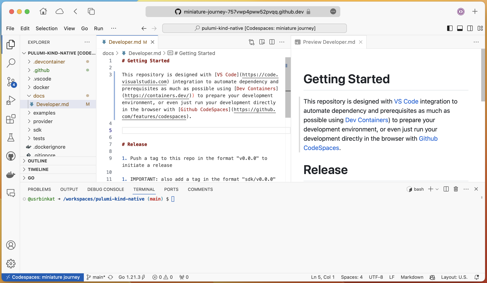
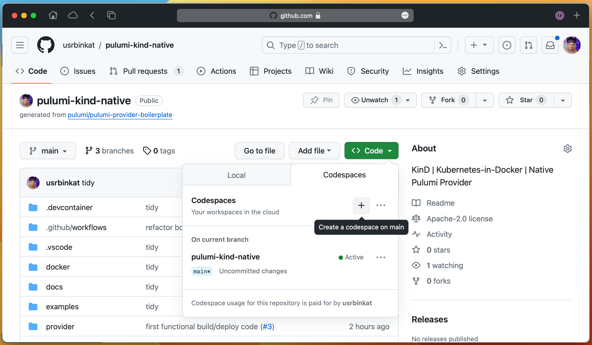
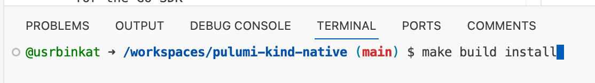
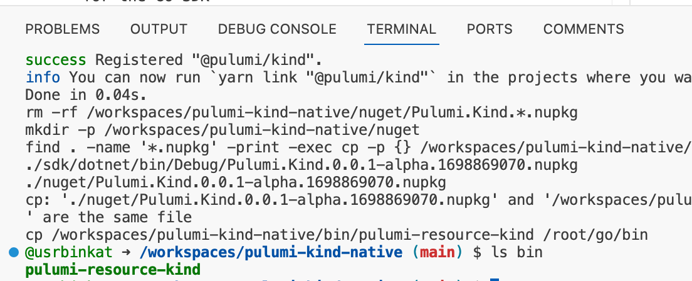
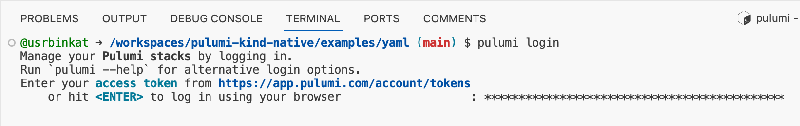
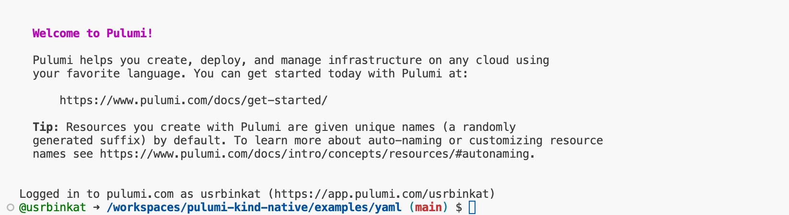
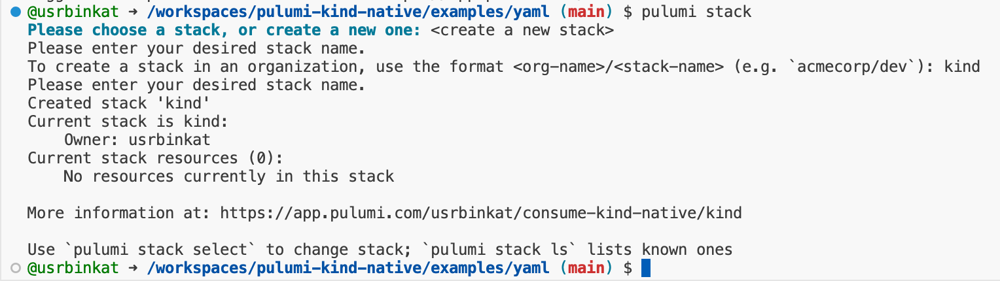
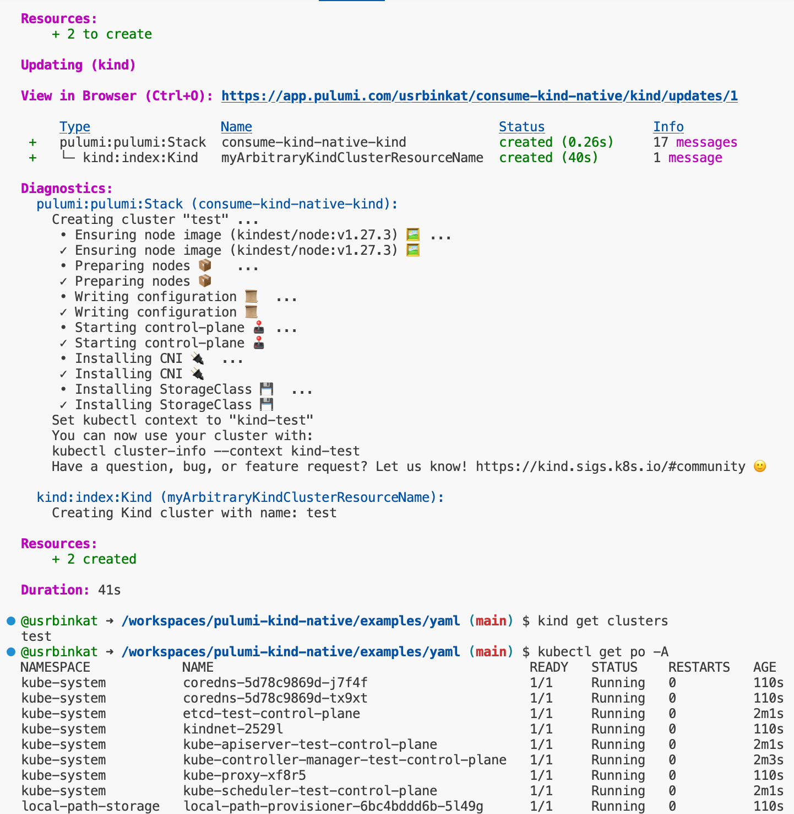

# About

This repository is designed with [VS Code](https://code.visualstudio.com) integration to automate dependency and prerequisites as much as possible using [Dev Containers](https://containers.dev/)) to prepare your development environment, or even just run your development directly in the browser with [Github CodeSpaces](https://github.com/features/codespaces).



# Getting Started

To start, open this repository in Github CodeSpaces, or clone the repo locally and launch with VS Code using the devcontainer.

> Fig 1. How to open project in CodeSpaces


# Workflow

## Build & Install

Build and install this provider in your dev container.

```bash
make build install
```

> Fig 2.a Command `make build install` in terminal



## Test

1. Pulumi Login

```bash
pulumi login
```

> Fig 2.b pulumi login



2. Create a new Pulumi 'stack'

```bash
cd examples/yaml
pulumi stack init kind
pulumi stack select kind
```

> Fig 2.c pulumi stack


3. Set pulumi config key values

```bash
pulumi config set name kind-provider-dev
```

4. Run `pulumi up`

```bash
pulumi up
```

> Fig 2.d pulumi up


# Release

1. Push a tag to this repo in the format "v0.0.0" to initiate a release

1. IMPORTANT: also add a tag in the format "sdk/v0.0.0" for the Go SDK
